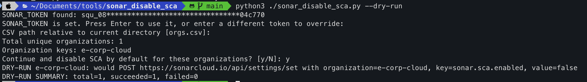

# sonar_disable_sca.py

Disable SonarQube Cloud SCA by default for multiple organizations listed in a CSV file.

This script is meant for SonarQube Cloud only. It is not for SonarQube Server.



## Requirements

- Python 3
- No external Python packages
- `SONAR_TOKEN` environment variable set
- Token must belong to a user with organization admin rights for every target org

Project analysis tokens are not enough. A `403 Insufficient privileges` response means the token is valid, but the user lacks org admin permission for that organization.

## CSV Input

Default file: `orgs.csv` in the current working directory.

Format:

```csv
org-key-1
org-key-2
org-key-3
```

Rules:

- One organization key per row
- No header
- Empty rows ignored
- Surrounding whitespace ignored
- Duplicate org keys removed while preserving first-seen order

## Run

PowerShell:

```powershell
$env:SONAR_TOKEN = "your-token"
python .\sonar_disable_sca.py
```

Windows CMD:

```cmd
set SONAR_TOKEN=your-token
python sonar_disable_sca.py
```

macOS/Linux:

```sh
export SONAR_TOKEN="your-token"
python3 ./sonar_disable_sca.py
```

Dry run:

```sh
python3 ./sonar_disable_sca.py --dry-run
```

## Prompts

If `SONAR_TOKEN` exists, script shows masked token only:

```text
SONAR_TOKEN found: abcdef**************uvwxyz
```

Press Enter to use env token, or paste another token to override it for this run.

CSV prompt:

```text
CSV path relative to current directory [orgs.csv]:
```

Press Enter to use `orgs.csv`, or type another CSV path.

Final confirmation:

```text
Continue and disable SCA by default for these organizations? [y/N]:
```

Press `y` or `Y` to proceed. Any other key cancels with no changes.

## API Action

For each org, script sends:

```text
POST https://sonarcloud.io/api/settings/set
organization=<ORG_KEY>
key=sonar.sca.enabled
value=false
```

Authentication uses HTTP Basic Auth with `SONAR_TOKEN` as username and empty password.

## Exit Codes

- `0`: all requests succeeded, dry run succeeded, or user cancelled
- Non-zero: missing token, invalid CSV, empty CSV, or one or more API calls failed

## Troubleshooting

- `HTTP 403 Insufficient privileges`: token user lacks org admin rights for that org
- `SONAR_TOKEN environment variable is missing`: set env var before running
- CSV parse error: ensure one org key per row, no extra comma-separated columns
